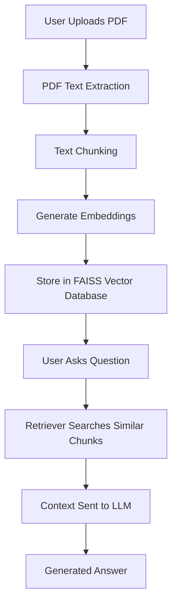

# 📄 RAG PDF Question Answering System

A **Retrieval-Augmented Generation (RAG)** system that allows users to **upload a PDF and ask questions about its content**.
The system extracts text from uploaded documents, converts it into vector embeddings, stores them in a vector database, and retrieves relevant context to answer user queries.

This project demonstrates how modern AI applications combine **document retrieval and language models** to generate accurate, context-aware responses.

---

# 🚀 Features

* Upload PDF documents through an API
* Extract text from documents automatically
* Split documents into semantic chunks
* Generate embeddings using HuggingFace models
* Store embeddings in a FAISS vector database
* Retrieve relevant document sections using semantic search
* Generate answers grounded in the document context
* Interactive API documentation with FastAPI Swagger

---

# 🧠 RAG Architecture

The system follows a **Retrieval-Augmented Generation pipeline**, where information retrieval is combined with LLM reasoning.



---

# 🛠 Tech Stack

* **Python**
* **FastAPI** – API development
* **LangChain** – RAG utilities
* **LangGraph** – workflow orchestration
* **HuggingFace Sentence Transformers** – embeddings
* **FAISS** – vector similarity search
* **PyPDF** – PDF text extraction
* **Uvicorn** – ASGI server

---

# ⚙️ Installation

### 1️⃣ Clone the repository

```bash
git clone https://github.com/ankita383/RAG.git
cd RAG
```

---

### 2️⃣ Install dependencies using `uv`

```bash
uv sync
```

Or install manually:

```bash
uv add fastapi uvicorn langchain langgraph langchain-community \
sentence-transformers transformers torch faiss-cpu pypdf python-dotenv python-multipart
```

---

### 3️⃣ Create environment variables

Create a `.env` file in the project root:

```
GROQ_API_KEY=your_api_key
```

---

# ▶️ Running the Application

Start the server:

```bash
uv run uvicorn app.main:app --reload
```

Then open the API documentation:

```
http://127.0.0.1:8000/docs
```

---

# 📌 API Endpoints

### Upload PDF

```
POST /upload_pdf
```

Uploads a document and processes it into embeddings.

---

### Ask Question

```
POST /ask
```

Example request:

```
question: What are the key points discussed in this document?
```

The system retrieves relevant document chunks and generates an answer.

---
ull Stack Development
